# Cronograma de adjudicación de Concesiones de Uso Oneroso (CUO)
## Ministerio de Bienes Nacionales — vía asignación directa y vía licitación pública

**Versión:** 1.0 · **Fecha de elaboración:** septiembre de 2026
**Alcance:** estimación de actividades, secuencia y plazos por etapa para obtener una CUO sobre inmueble fiscal, en las dos modalidades de adjudicación previstas en el DL N° 1.939, de 1977.
**Referencias:** normativa y fuentes públicas desde 2021 en adelante (ver §8).

---

## 1. Marco normativo y supuestos de base

### 1.1 Norma habilitante

| Elemento | Contenido | Fuente |
|---|---|---|
| Naturaleza | Derecho especial de uso y goce de un bien de dominio fiscal, con objetivo preestablecido | DL N° 1.939/1977, arts. 57 y ss. |
| Plazo máximo | 50 años | DL N° 1.939, art. 57 y ss. |
| Contraprestación | Renta anual a valor comercial, por todo el período del contrato | DL N° 1.939 |
| Modalidades de adjudicación | (i) Licitación pública o privada, nacional o internacional; (ii) **directa, en casos debidamente fundados** | DL N° 1.939, arts. 57 y ss. |
| Tasación y fijación de renta | La **Comisión Especial de Enajenaciones** (art. 85 DL N° 1.939), previa tasación, propone al Ministro el derecho o renta y su forma de pago. Solo en casos calificados y por decreto fundado puede fijarse renta inferior a la propuesta | DL N° 1.939, arts. 61 y 85 |
| Perfeccionamiento | El adjudicatario debe suscribir el contrato de concesión **por escritura pública dentro de 30 días contados desde la publicación en el Diario Oficial** | DL N° 1.939 |
| Modificaciones relevantes | Ley N° 19.606 (1999) y Ley N° 19.833 (2002); Ley N° 21.770 (2025) | — |

### 1.2 Capa regulatoria nueva: Ley N° 21.770 (Ley Marco de Autorizaciones Sectoriales, "LMAS")

Publicada en el Diario Oficial el **29 de septiembre de 2025**. Es la referencia más actualizada que impacta directamente estos plazos:

- Clasifica las autorizaciones sectoriales por tipología (entre ellas, **autorizaciones de administración o disposición**, categoría en la que se encuadra la CUO sobre inmueble fiscal) y fija **plazos máximos de resolución de entre 25 y 120 días** según tipología.
- Regula el **silencio administrativo** con efecto y tramitación diferenciados por tipología; la Oficina de Autorizaciones Sectoriales e Inversión emite certificados automáticos de silencio (art. 24, inc. 4°).
- Modifica más de 40 cuerpos legales sectoriales, incluido el DL N° 1.939.
- Meta declarada de política pública: reducir tiempos de espera entre **30% y 70%** (50% en proyectos estratégicos).
- **Entrada en vigencia gradual:** rige desde su publicación salvo los artículos transitorios exceptuados; la gradualidad por servicio se determina vía DFL N° 2. En diciembre de 2025 se dictó Decreto Exento que fija diagnóstico y supervisión sobre 7 instituciones clave.

> **Supuesto de trabajo del cronograma:** mientras no se complete la gradualidad de la LMAS para el MBN, los plazos reales siguen gobernados por la práctica administrativa observada 2021–2026. El cronograma presenta el **escenario vigente** y, en §6, el **escenario LMAS plenamente aplicado**.

### 1.3 Instrumentos especiales del MBN (asignación directa "concursada")

| Instrumento | Objeto | Hito |
|---|---|---|
| Rex N° 998, de 23.11.2021 | Plan Nacional de Fomento a la Producción de Hidrógeno Verde en Territorio Fiscal ("Ventana al Futuro") — ventana única de postulación a CUO **directas** de hasta 40 años | Modificada por Rex N° 827 (29.07.2022) y Rex N° 1.302 (26.12.2022, D.O. 04.01.2023) |
| Rex N° 375, de 18.04.2024 (D.O. 06.05.2024) | Plan Nacional para Impulsar Proyectos de Sistemas de Almacenamiento de Energía en Terreno Fiscal — CUO **directas** de hasta 40 años en macrozona norte | Ventana de postulación abierta el 13.05.2024 por 10 días |

### 1.4 Línea base de plazos observados (benchmark)

| Indicador | Valor | Fuente |
|---|---|---|
| Plazo de respuesta declarado del trámite CUO | **14 meses**, salvo excepciones | Ficha ChileAtiende N° 56395 |
| Plazo de tramitación promedio real vs. plazo legal | **14 meses** reales vs. **6 meses** legales | CNEP, *Análisis de los permisos sectoriales prioritarios para la inversión en Chile* (jul-2023, datos 2018–2022) |
| Ventana H2V: apertura → primer decreto publicado | nov-2021 → **13.07.2023** (≈ 20 meses) | Decreto proyecto Parés y Álvarez, Calama (13 ha, 20 MW electrólisis) |
| Licitación ERNC 2024-2025: consultas → adjudicación | 24.12.2024 → **02.05.2025** (≈ 4,5 meses) | Cronograma MBN, 10 procesos en Antofagasta y Atacama |
| Cartera CUO renovables vigente (2026) | 236 contratos activos + **164 concesiones en tramitación**; ~$62 mil MM/año al Fisco | MBN / Diario Financiero, 2026 |

---

## 2. Cronograma A — CUO por **asignación directa**

Aplica cuando existe caso debidamente fundado (proyecto de interés público, ausencia de competencia por el polígono, o postulación dentro de un plan especial vigente como los de H2V y almacenamiento).

### 2.1 Estructura por etapas

| # | Etapa | Actividades clave | P50 | P80 | Responsable | Tipo |
|---|---|---|---|---|---|---|
| **E0** | Prefactibilidad y *due diligence* territorial *(previo al ingreso)* | Identificación del polígono en catastro fiscal; verificación de disponibilidad; screening de restricciones (SNASPE/áreas protegidas, sitios prioritarios, Consejo de Monumentos Nacionales, concesiones mineras superpuestas, tierras y comunidades indígenas, servidumbres, IPT/PRC, zona fronteriza); layout preliminar y definición de superficie, destino y plazo solicitado | 1,5 m | 3,0 m | Titular | Preparatoria |
| **E1** | Ingreso y admisibilidad | Solicitud formal vía plataforma en línea del MBN (ClaveÚnica) o SEREMI/Oficina Provincial; identificación completa, memoria del proyecto, plano referencial, personería, acreditación de capacidad técnica y financiera; revisión de admisibilidad; ciclo de observaciones y subsanación | 1,0 m | 1,5 m | MBN / Titular | **Ruta crítica** |
| **E2** | Informes de disponibilidad e intersectoriales | Certificado de disponibilidad y no afectación del inmueble; oficios y respuestas de organismos competentes (MINVU/DOM por IPT, CONAF/MMA, CMN, DGA, SERNAGEOMIN, Vialidad-MOP, Municipalidad, CONADI, Subsecretaría para las FF.AA. si zona fronteriza) | 4,0 m | 7,0 m | MBN + servicios | **Ruta crítica — mayor varianza** |
| **E3** | Evaluación técnica y económica del proyecto | Informe técnico de la División de Bienes / SEREMI; evaluación de cronograma de inversión, hitos de cumplimiento y capacidad financiera. En planes especiales, informe del Ministerio de Energía (p. ej. Of. Ord. N° 777/2024 en el Plan de Almacenamiento) | 2,0 m | 3,5 m | MBN / Min. Energía | Paralelo a E2 |
| **E4** | Mensura, plano y minuta de deslindes | Elaboración o revisión del plano por personal técnico del MBN; minuta de deslindes; informe de superficie definitiva | 2,0 m | 3,0 m | MBN / Titular | Paralelo a E2 |
| **E5** | Tasación y fijación de la renta concesional | Tasación comercial del inmueble; pronunciamiento de la Comisión Especial de Enajenaciones (art. 85) proponiendo renta y forma de pago; visación ministerial | 2,0 m | 3,0 m | MBN / CEE | **Ruta crítica** |
| **E6** | Comunicación de condiciones y aceptación | Notificación de condiciones (renta, plazo, garantías, hitos, causales de caducidad); aceptación formal del solicitante; constitución de sociedad chilena si el titular es extranjero; entrega de garantía de fiel cumplimiento | 1,5 m | 2,0 m | Titular / MBN | **Ruta crítica** |
| **E7** | Dictación del acto y control de legalidad | Elaboración y firma del decreto supremo del MBN (por orden del Presidente de la República) que otorga la concesión; firma de Hacienda cuando corresponde; **toma de razón** en Contraloría; publicación del extracto en el Diario Oficial | 3,0 m | 5,0 m | MBN / CGR | **Ruta crítica** |
| **E8** | Perfeccionamiento e inscripción | Suscripción de la **escritura pública dentro de 30 días desde la publicación en el D.O.**; pago de la primera renta y derechos; decreto que aprueba el contrato concesional; inscripción en el CBR y anotación en catastro; entrega material del inmueble | 1,5 m | 3,0 m | Titular / MBN | **Ruta crítica** |

### 2.2 Totales

| Escenario | Desde ingreso (E1) hasta contrato inscrito (E8) | Incluyendo prefactibilidad (E0) |
|---|---|---|
| **P50 (probable)** | **≈ 13–14 meses** | ≈ 15 meses |
| **P80 (conservador)** | **≈ 21–22 meses** | ≈ 25 meses |
| Escenario adverso | 30+ meses | 33+ meses |

El P50 es consistente con los 14 meses declarados por ChileAtiende y con el promedio medido por la CNEP.

### 2.3 Diagrama

```mermaid
gantt
    title CUO por asignación directa — escenario P50 (meses)
    dateFormat X
    axisFormat %s
    section Preparación
    E0 Prefactibilidad y due diligence      :done, e0, 0, 1.5
    section Tramitación MBN
    E1 Ingreso y admisibilidad              :crit, e1, 1.5, 1
    E2 Informes intersectoriales            :crit, e2, 2.5, 4
    E3 Evaluación técnica y económica       :e3, 3, 2
    E4 Mensura, plano y deslindes           :e4, 3.5, 2
    E5 Tasación y renta concesional         :crit, e5, 6.5, 2
    E6 Condiciones y aceptación             :crit, e6, 8.5, 1.5
    section Acto y cierre
    E7 Decreto, toma de razón y D.O.        :crit, e7, 10, 3
    E8 Escritura pública e inscripción CBR  :crit, e8, 13, 1.5
```



---

## 3. Cronograma B — CUO por **licitación pública**

Se descompone en tres fases. La Fase A es interna del MBN y normalmente **no es visible ni influenciable** por el interesado; el cronograma del oferente comienza en la Fase B.

### 3.1 Fase A — Preparación del portafolio (MBN, previa al llamado)

| # | Etapa | Actividades | P50 | P80 |
|---|---|---|---|---|
| A1 | Selección y saneamiento del polígono | Identificación de inmuebles disponibles; regularización de dominio y deslindes; plano y mensura | 3,0 m | 5,0 m |
| A2 | Autorizaciones y consultas previas | Informes intersectoriales y de disponibilidad territorial | 3,0 m | 5,0 m |
| A3 | Tasación y renta mínima | Tasación comercial; Comisión Especial de Enajenaciones fija la **renta mínima anual en UF** por lote | 1,5 m | 2,5 m |
| A4 | Bases administrativas y técnicas especiales | Redacción de bases (criterios de evaluación, garantías, hitos de inversión, plazo concesional); aprobación por resolución; visto bueno jurídico | 2,0 m | 3,0 m |
| **Subtotal Fase A** | | | **≈ 6–8 meses** | **≈ 11–13 meses** |

> Referencia 2026: el MBN tiene una cartera de **32 polígonos, más de 21.000 ha** en la macrozona norte destinados a licitación para ERNC, además de los primeros procesos orientados a *data centers*.

### 3.2 Fase B — Proceso concursal (desde el llamado hasta la adjudicación)

| # | Etapa | Actividades | P50 | P80 | Actor |
|---|---|---|---|---|---|
| B1 | Publicación del llamado y bases | Publicación en Diario Oficial, sitio del MBN y portal de licitaciones; disponibilidad de bases y antecedentes por lote | 0,5 m | 0,5 m | MBN |
| B2 | Período de consultas | Consultas escritas de los interesados dentro del plazo de las bases | 0,5 m (10–15 días) | 0,75 m | Oferentes |
| B3 | Respuestas y aclaraciones | Circulares aclaratorias; eventuales modificaciones de bases y prórrogas | 0,5 m | 1,0 m | MBN |
| B4 | Preparación de la oferta | Visita a terreno; propuesta técnica y económica según formalidades de las bases; **documento de garantía de seriedad de la oferta**; antecedentes legales y financieros | 1,5 m | 2,0 m | Oferente *(traslapa B2–B3)* |
| B5 | Recepción y apertura de ofertas | Acto público de recepción y apertura en fecha y hora fijadas en bases (típicamente el mismo día) | 1 día | 1 día | MBN |
| B6 | Evaluación | Comisión evaluadora; revisión de admisibilidad, evaluación técnica y económica; solicitud de aclaraciones | 1,5 m | 2,5 m | MBN |
| B7 | Adjudicación | Resolución/decreto de adjudicación; notificación al adjudicatario; devolución de garantías a no adjudicados | 1,0 m | 1,5 m | MBN |
| **Subtotal Fase B** | | | **≈ 4,5–5 meses** | **≈ 6,5 meses** | |

> **Validación con caso real (proceso ERNC 2024–2025, Antofagasta y Atacama, 10 lotes):** consultas del **24.12.2024 al 06.01.2025**; recepción de ofertas y garantías del **10.02.2025 al 12.02.2025, 14:00 h**; adjudicación programada **hasta el 02.05.2025**. Total consultas→adjudicación ≈ **4,3 meses**, dentro del P50 estimado.

### 3.3 Fase C — Perfeccionamiento del contrato

| # | Etapa | Actividades | P50 | P80 |
|---|---|---|---|---|
| C1 | Publicación del acto de adjudicación en el Diario Oficial | Extracto en D.O. — **hito que gatilla el plazo legal de 30 días** | 0,75 m | 1,0 m |
| C2 | Suscripción de escritura pública | Firma del contrato concesional por escritura pública **dentro de 30 días desde la publicación en el D.O.**; entrega de garantía de fiel cumplimiento; pago de la primera renta | 1,0 m | 1,5 m |
| C3 | Decreto aprobatorio y control de legalidad | Decreto que aprueba el contrato concesional; toma de razón en Contraloría | 2,0 m | 4,0 m |
| C4 | Inscripción y entrega | Inscripción en el Conservador de Bienes Raíces; anotación en catastro; acta de entrega material | 0,75 m | 1,5 m |
| **Subtotal Fase C** | | | **≈ 4,5 meses** | **≈ 8 meses** |

### 3.4 Totales

| Horizonte | P50 | P80 |
|---|---|---|
| **Oferente** (llamado → contrato inscrito): B1→C4 | **≈ 9 meses** | **≈ 14,5 meses** |
| **Proceso completo MBN** (preparación → contrato inscrito): A1→C4 | **≈ 15–17 meses** | **≈ 27 meses** |

### 3.5 Diagrama

```mermaid
gantt
    title CUO por licitación pública — escenario P50 (meses)
    dateFormat X
    axisFormat %s
    section Fase A · MBN (previa)
    A1 Selección y saneamiento del polígono :a1, 0, 3
    A2 Autorizaciones previas               :a2, 1.5, 3
    A3 Tasación y renta mínima              :a3, 4.5, 1.5
    A4 Bases administrativas y técnicas     :a4, 6, 2
    section Fase B · Concurso
    B1 Publicación del llamado y bases      :crit, b1, 8, 0.5
    B2 Consultas                            :b2, 8.5, 0.5
    B3 Respuestas y aclaraciones            :b3, 9, 0.5
    B4 Preparación de la oferta             :crit, b4, 8.5, 1.5
    B5 Apertura de ofertas                  :milestone, b5, 10, 0
    B6 Evaluación                           :crit, b6, 10, 1.5
    B7 Adjudicación                         :crit, b7, 11.5, 1
    section Fase C · Cierre
    C1 Publicación en Diario Oficial        :crit, c1, 12.5, 0.75
    C2 Escritura pública (30 días legales)  :crit, c2, 13.25, 1
    C3 Decreto aprobatorio y toma de razón  :crit, c3, 14.25, 2
    C4 Inscripción CBR y entrega            :crit, c4, 16.25, 0.75
```

---

## 4. Comparación de las dos vías

| Dimensión | Asignación directa | Licitación pública |
|---|---|---|
| Gatillo del proceso | Solicitud del interesado (o ventana de un plan especial) | Llamado del MBN sobre polígonos predefinidos |
| Control del *timing* por el titular | Alto en el ingreso, bajo en la tramitación | Nulo — depende del calendario del MBN |
| **Plazo P50 para el titular** | **≈ 13–14 meses** desde el ingreso | **≈ 9 meses** desde el llamado |
| **Plazo P80 para el titular** | ≈ 21–22 meses | ≈ 14,5 meses |
| Plazo total incluyendo preparación estatal | 15 meses (P50) | 15–17 meses (P50) |
| Riesgo de no obtención | Rechazo por falta de fundamento del caso directo o por informe sectorial desfavorable | Riesgo competitivo: perder frente a otra oferta |
| Definición de la renta | Tasación + Comisión Especial de Enajenaciones | Renta mínima en bases + puja económica al alza |
| Selección del polígono | El titular elige el paño | Limitado a los lotes ofertados |
| Certeza de calendario | Baja (alta varianza en E2 y E7) | Alta hasta la adjudicación; baja en Fase C |
| Uso típico 2021–2026 | H2V (Rex 998/2021), almacenamiento (Rex 375/2024), proyectos singulares fundados | Paquetes ERNC en Antofagasta, Atacama y Tarapacá; próximos lotes para *data centers* |

**Lectura práctica:** la licitación es más rápida y predecible **para el titular** porque el Estado ya absorbió, en la Fase A, el trabajo territorial, la tasación y las consultas intersectoriales que en la vía directa recaen sobre la tramitación individual. El costo es la pérdida de control sobre qué paño y cuándo.

---

## 5. Ruta crítica y factores de desviación

### 5.1 Actividades de ruta crítica
- **Vía directa:** E1 → E2 → E5 → E6 → E7 → E8. E2 (informes intersectoriales) concentra la mayor varianza del proceso completo.
- **Vía licitación:** B4 → B6 → B7 → C1 → C2 → C3. C3 (toma de razón) es el principal riesgo de cola.

### 5.2 Factores que extienden el cronograma

| Factor | Impacto estimado | Aplica a |
|---|---|---|
| Inmueble en **zona fronteriza** o titular extranjero (restricciones DL N° 1.939 y DFL N° 4/1967) | +2 a 4 meses | Ambas |
| **Consulta indígena** (Convenio 169 OIT) por afectación a comunidades o tierras CONADI | +6 a 12 meses | Ambas |
| **Superposición con concesiones mineras** vigentes | +1 a 3 meses (negociación de compatibilidad) | Ambas |
| Hallazgos arqueológicos / pronunciamiento del **Consejo de Monumentos Nacionales** | +2 a 6 meses | Ambas |
| **Representación por Contraloría** en toma de razón y reingreso del acto | +1 a 3 meses por ciclo | Ambas |
| Observaciones al **plano o minuta de deslindes** | +1 a 2 meses por ciclo | Ambas |
| Expediente incompleto en el ingreso | +1 a 2 meses por ciclo de subsanación | Directa |
| **Modificación de bases** o prórroga del plazo de ofertas | +0,5 a 1,5 meses | Licitación |
| **Impugnaciones** al acto de adjudicación (recursos administrativos) | +2 a 6 meses | Licitación |
| Cambio de gobierno / rotación de autoridades regionales | +1 a 3 meses | Ambas |

### 5.3 Factores que comprimen el cronograma
- Postulación dentro de un **plan especial vigente** (H2V, almacenamiento): el MBN precalifica el territorio y coordina el informe sectorial, lo que absorbe parte de E2 y E3.
- Aportar **plano y mensura propios** en condiciones de ser visados: reduce E4 en 1–2 meses.
- Presentar el expediente completo y la personería vigente al ingreso: elimina ciclos de subsanación en E1.
- Aplicación plena de la LMAS (ver §6).

---

## 6. Escenario prospectivo: LMAS plenamente aplicada al MBN

Si se materializa la meta de la Ley N° 21.770 (reducción de 30%–70%, y 50% en proyectos estratégicos) junto con el modelo de **informe único consolidado** —admisibilidad preliminar en no más de 20 días y recopilación centralizada por el MBN de los informes técnicos de todos los organismos competentes—, la proyección es:

| Vía | Situación actual (P50) | Escenario LMAS (P50) | Reducción |
|---|---|---|---|
| Asignación directa (E1→E8) | 13–14 meses | **6–9 meses** | 35%–55% |
| Licitación, horizonte oferente (B1→C4) | 9 meses | **5–6,5 meses** | 30%–45% |

El grueso del ahorro proviene de E2 (informes intersectoriales, hoy secuenciales) y de la aplicación de plazos máximos con silencio administrativo. **Este escenario no debe usarse para comprometer fechas contractuales** mientras no se publique la gradualidad específica del MBN.

---

## 7. Recomendaciones de gestión del cronograma

1. **Front-load la Etapa 0.** El *due diligence* territorial completo antes de ingresar reduce el P80 más que cualquier gestión posterior. Los rechazos y las prórrogas largas casi siempre se originan en restricciones detectables ex ante.
2. **Paralelice E3 y E4 con E2** entregando voluntariamente el plano, la minuta de deslindes y la memoria técnica junto con la solicitud.
3. **Reserve caja para la renta desde el mes 12–14.** El pago de la primera renta y la garantía de fiel cumplimiento vencen en el perfeccionamiento, no en la adjudicación.
4. **Trate el plazo de 30 días para la escritura pública como un hito duro.** Tener notaría, poderes y fondos listos antes de la publicación en el D.O. evita el riesgo de perder la adjudicación por vencimiento.
5. **Monitoree las ventanas de los planes especiales.** Han sido cortas (la del Plan de Almacenamiento estuvo abierta 10 días desde el 13.05.2024) y son el camino más rápido a una asignación directa fundada.
6. **En licitación, presupueste la garantía de seriedad de la oferta** con al menos 6 semanas de anticipación a la apertura.
7. **Encadene el cronograma CUO con el resto de la permisología** (SEA, concesión eléctrica, conexión al SEN). La CUO no es el permiso más largo, pero sí es condición previa para varios de ellos: un retraso en E7–E8 propaga al resto de la ruta crítica del proyecto.

---

## 8. Referencias

**Normativa**
- DL N° 1.939, de 1977, del Ministerio de Tierras y Colonización — Normas sobre adquisición, administración y disposición de bienes del Estado, arts. 57 y ss. y art. 85 (modificado por Ley N° 19.606/1999 y Ley N° 19.833/2002) — https://www.bcn.cl/leychile/navegar?idNorma=6778
- Ley N° 21.770 (D.O. 29.09.2025) — Establece una Ley Marco de Autorizaciones Sectoriales e introduce modificaciones a los cuerpos legales que indica — https://www.leychile.cl/leychile/Navegar?idNorma=1216930
- Resolución Exenta N° 998, de 23.11.2021, MBN — Aprueba Plan Nacional de Fomento a la Producción de Hidrógeno Verde en Territorio Fiscal; modificada por Rex N° 827 (29.07.2022) y Rex N° 1.302 (26.12.2022, D.O. 04.01.2023) — https://www.bienesnacionales.cl/wp-content/uploads/2022/12/Rex-1302-26.12.2022-Modifica-y-Complementa-Rex.998-23.11.21-Ref.-a-Plan-Nacional-de-Hidrogeno-Verde.pdf
- Resolución Exenta N° 375, de 18.04.2024, MBN (D.O. 06.05.2024) — Aprueba Plan Nacional para Impulsar Proyectos de Sistemas de Almacenamiento de Energía en Terreno Fiscal — https://www.bienesnacionales.cl/wp-content/uploads/2024/04/Rex.375-18.04.24._Aprueba_Plan_Nacional_Proyectos_de_Sistemas_Almacenamiento_Energia.-5523.pdf
- Decreto Exento (diciembre 2025), Ministerio de Economía — Fija diagnóstico y supervisión a 7 servicios clave bajo la LMAS — https://www.economia.gob.cl/2025/12/29/nuevo-paso-de-ley-de-autorizaciones-sectoriales-dictan-decreto-exento-para-supervisar-proceso-de-7-instituciones-clave-en-entrega-de-permisos.htm

**Procedimiento y plazos oficiales**
- ChileAtiende, ficha N° 56395 — Concesión de uso oneroso de un inmueble fiscal (plazo declarado: 14 meses) — https://www.chileatiende.gob.cl/fichas/56395-concesion-de-uso-oneroso-de-un-inmueble-fiscal
- MBN — Concesión de Uso Oneroso de un Inmueble Fiscal — https://www.bienesnacionales.cl/gestion-del-territorio/instrumentos-de-gestion/concesiones-onerosas/
- MBN — Portal de Licitaciones — https://licitaciones.mbienes.gob.cl/
- MBN — Trámites digitalizados / trámites en línea — https://www.bienesnacionales.cl/digitalizacion-tramites-online/

**Evidencia empírica de plazos**
- CNEP (2023), *Análisis de los permisos sectoriales prioritarios para la inversión en Chile* (439 trámites, período 2018–2022) — CUO del MBN: 14 meses reales vs. 6 meses legales — https://cnep.cl/comision-nacional-de-evaluacion-y-productividad-analizara-los-permisos-sectoriales-prioritarios-para-invertir/
- El Mostrador (07.07.2023), *Hasta 11 años de tramitación: CNEP apunta a alta demora de permisos para invertir en Chile* — https://www.elmostrador.cl/mercados/2023/07/07/hasta-11-anos-de-tramitacion-cnep-apunta-a-alta-demora-de-permisos-para-invertir-en-chile/
- Carey (2025), *Ministerio de Bienes Nacionales abre nuevos procesos de licitación de terrenos fiscales* — cronograma del proceso ERNC 2024–2025 — https://www.carey.cl/ministerio-de-bienes-nacionales-abre-nuevos-procesos-de-licitacion-de-terrenos-fiscales
- Diario Financiero (2026), *Bienes Nacionales licitará más de 21 mil hectáreas de suelo fiscal para energías renovables y avanza en concesiones para data centers* — https://www.df.cl/empresas/industria/bienes-nacionales-licitara-mas-de-21-mil-hectareas-de-suelo-fiscal-para
- Diario Financiero, *Permisología: Gobierno busca que Bienes Nacionales simplifique aprobación de proyectos con informe único consolidado* — https://www.df.cl/empresas/permisologia-gobierno-busca-que-bienes-nacionales-simplifique
- Ministerio de Energía — *Comienza periodo de postulaciones para la asignación de terrenos fiscales a proyectos de almacenamiento de energía* — https://energia.gob.cl/noticias/nacional/comienza-periodo-de-postulaciones-para-la-asignacion-de-terrenos-fiscales-proyectos-de-almacenamiento-de-energia
- Ministerio de Energía — *La iniciativa "Ventana al Futuro"…* — https://energia.gob.cl/noticias/nacional/la-iniciativa-ventana-al-futuro-consiste-en-un-periodo-unico-y-excepcional-para-asignar-terrenos-para-la-produccion-de-hidrogeno-verde
- MBN — *Hidrógeno Verde: Bienes Nacionales tramita 16 proyectos en terrenos fiscales* — https://www.bienesnacionales.cl/?p=45210
- MBN — *Plan Nacional para Impulsar Sistemas de Almacenamiento* — https://www.bienesnacionales.cl/46367-2/
- Guía explicativa LMAS 2025, Oficina de Grandes Proyectos, Ministerio de Economía — https://ogp.economia.cl/wp-content/uploads/2025/11/guia-explicativa-lmas-general.pdf

---

## 9. Nota metodológica y limitaciones

- **P50** = duración probable en condiciones normales; **P80** = duración con margen de contingencia, recomendada para comprometer fechas con terceros.
- Los plazos marcados como **legales** (50 años de plazo máximo; 30 días para suscribir la escritura pública; 25–120 días de la LMAS) provienen de norma expresa. **Todos los demás son estimaciones** construidas a partir de: (i) el plazo declarado por el MBN en ChileAtiende, (ii) la medición de la CNEP, y (iii) cronogramas reales publicados de procesos 2021–2026.
- El MBN **no publica un procedimiento reglamentario con plazos por etapa** para la CUO; la desagregación por etapas de este documento es una reconstrucción a partir de las actividades descritas en fuentes oficiales y de la práctica observada, no una norma citable.
- La aplicación efectiva de la Ley N° 21.770 al MBN depende de la gradualidad que fije el DFL respectivo. Verificar su estado antes de usar el escenario de §6.
- Recomendación: validar el cronograma con la SEREMI de Bienes Nacionales de la región del inmueble antes de fijar hitos contractuales, dado que la carga de trabajo regional varía significativamente (Antofagasta concentra 117 de los proyectos de la cartera CUO renovable).
